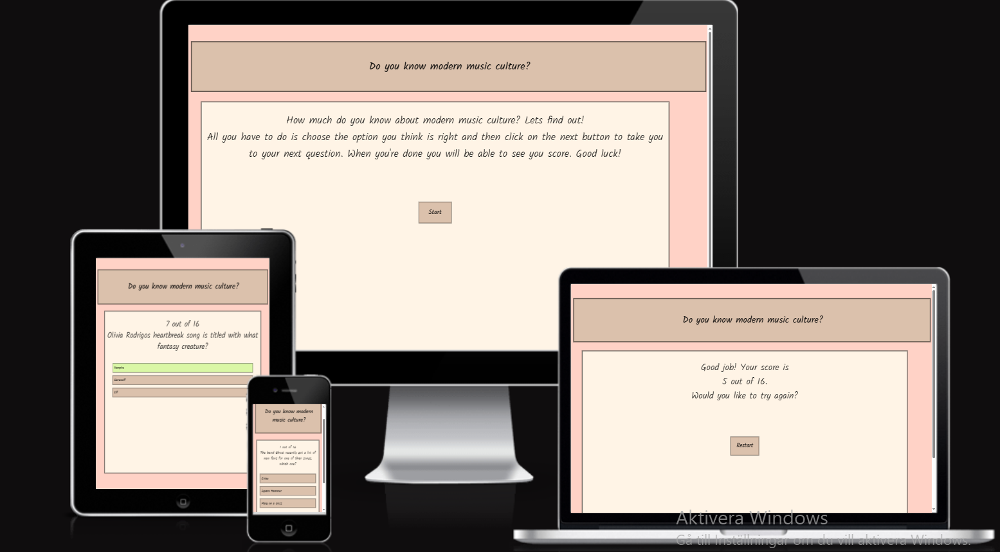
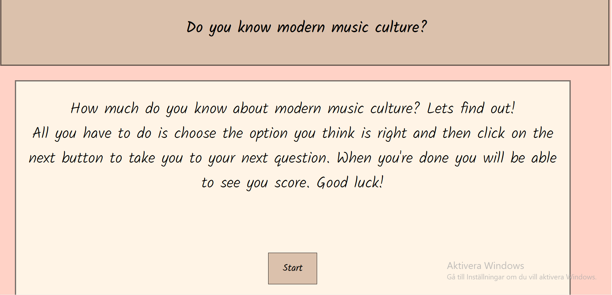
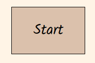
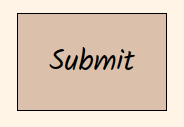
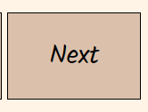
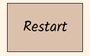
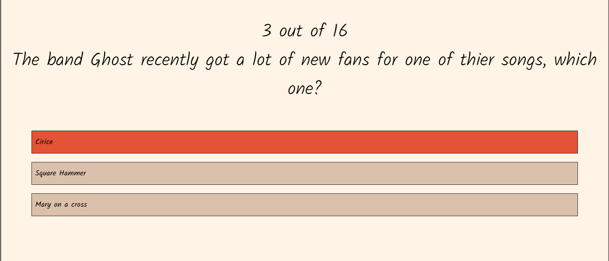
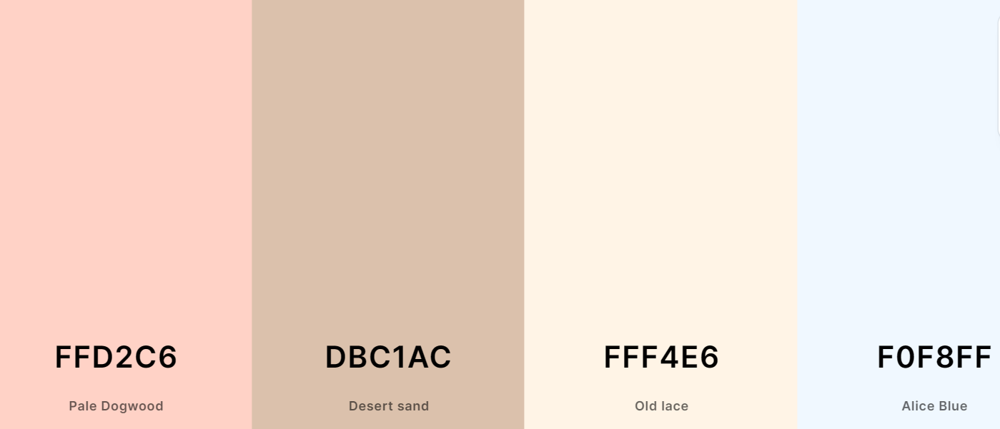

# Do you know modern music culture?

The purpose of this game is to test the players knowledge about moments and and songs in the modern music culture. With platforms like tiktok and instagram viral and well known moments are shared in a completely different way than it was before. You don't have to be a fan or even know an artist to keep up with everything that happens in the musical world, that information will be brought to you. Therfore it would be fun to test how aware people are.

The live website: [Music Quiz](https://elingrahn.github.io/music-quiz/)

## User stories

* As a visiting user I want to play a quiz game
* As a visiting user I want to have options to choose from
* As a visiting user I want it to be easy to move on to te next question
* As a visiting user I want to see how many questions I have done and how many I have left
* As a visiting user I want to knowwhich answer id correct
* As a visiting user I want to see my score at the end
* As a visiting user I want to be able to try the quiz again

## Features

### Start page

A small introduction to the game and what the visitor can expect

### Buttons

There is a start button, submit button, next button and a restart button

### The options

You can press the option you think is right and it will turn red or green depening if the answer is correct or not

### Score

At the end of the game you will be able to see your score
<!--Pic-->

## Typography and color scheeme

I wanted the game to have a youthful feel, since it is about the modern day music culture. The font family is Kalam from [Google fonts](https://fonts.google.com/).
The colors are in a soft neutral palette. I chose the colors from [Color hex](www.color-hex.com) and [HTML color codes](htmlcolorcodes.com)

## Technology

* HTML
  * For  the structure
* CSS
  * For styling
* JavaScript
  * For the interaction
* Codeanywhere
  * For writing and editing the code
* Github
  * To store all the files and changes made

## Testing

### Code Validation

The code has been validated and found no errors by using these validators:

* W3C Markup Validator
  * Validation of the HTML
* Jigsaw (Validator)
  * Validation of the CSS
* JSHint
  * Validation of the JavaScript

Testing accessability using Lighthouse
[Lighthouse](screenshots/pp2_accessability.png)

### Fixed bugs

* Random Questions
  * I know I was supposed to use the math object but there seem to be many different ways to use it. In the end by following W3schools code I got there.
* Restarting the game
  * The game went back to the last question asked instead of really starting over, so I realised I had to set the number index to 0 again as well as the score.
* Getting the correct answer to show up. 
  * For some reason when the correct answer is clicked it does not turn green as I've written in the if statement. I'm thinking the computer can't read the boolean for some reason. Still have not solved this.

### Unfixed bugs

### Supported sceens and browsers

The project has been made using Microsoft Edge and has been tested and used on safari and samsung.

## Deployment

### Github

The website was pushed from codeanywhere workspace to a Github repository

### Github Pages

The website was deployed to GitHub pages using the following steps:

Selecting the settings in your chosen repository

Scroll down and select main as your source

This will give you a deployed link

Here is the link for this project:

## Credits

### Content

* [Web Dev Sipmpified](https://www.youtube.com/watch?v=riDzcEQbX6k) and
[GreatStack](https://www.youtube.com/watch?v=PBcqGxrr9g8&t=863s) to help me get started on the project.

* [W3schools](https://www.w3schools.com/) to help me with the randomization of the questions array

* For the [DOMcontentloaded](https://developer.mozilla.org/en-US/docs/Web/API/Document/DOMContentLoaded_event)

### Media

* [Favicon](https://favicon.io/emoji-favicons/musical-notes)

* Picture of the color palette from [coolors](https://coolors.co/ffd2c6-dbc1ac-fff4e6-f0f8ff-d1e3dd)
